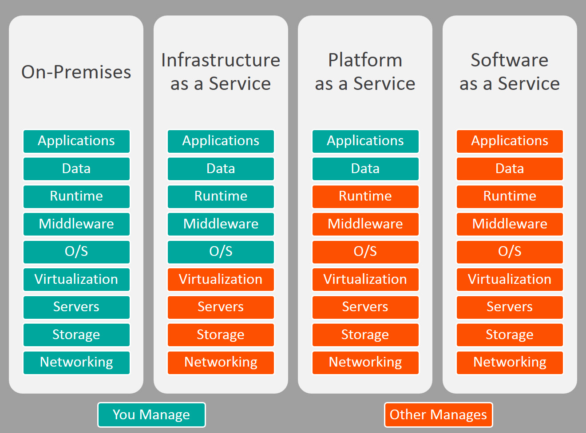

## Cloud Computing là gì?

- Cloud Computing là một mô hình cung cấp các dịch vụ tính toán, lưu
  trữ, mạng và ứng dụng thông qua mạng Internet. Thay vì phải tự
  quản lý và vận hành cơ sở hạ tầng máy chủ và hệ thống lưu trữ dữ
  liệu, người dùng có thể thuê tài nguyên máy chủ và lưu trữ từ các nhà
  cung cấp dịch vụ đám mây (Cloud Service Provider) và truy cập chúng
  thông qua Internet.
- Mô hình đám mây cung cấp cho người dùng sự linh hoạt và khả năng
  mở rộng dễ dàng, do đó giúp họ tiết kiệm chi phí và tối đa hóa hiệu
  quả hoạt động. Ngoài ra, đám mây cũng cung cấp các dịch vụ bảo
  mật, sao lưu dữ liệu và khôi phục dữ liệu trong trường hợp sự cố. Các
  ví dụ đại diện bao gồm Amazon Web Services, Microsoft Azure và
  Google Cloud Platform.

## On-Premise là gì?

- là hệ thống mà được cài đặt và vận hành trên nền tảng
  phần cứng và hạ tầng mạng nội bộ của tổ chức hoặc doanh nghiệp.
  Nói cách khác, "on-premise" đề cập đến việc triển khai và sử dụng hệ
  thống trên cơ sở vật chất của riêng mình, không phải trên môi trường
  Cloud hay máy chủ của bên thứ ba. Hệ thống On-premise được quản
  lý và bảo trì bởi đội ngũ IT của tổ chức đó.

## Public Cloud là gì?

- đây là loại hình Cloud mà tài nguyên máy chủ và dịch vụ
  được cung cấp cho khách hàng từ một Cloud Provider. Khách hàng sử
  dụng tài nguyên đó thông qua Internet và trả tiền cho nhà cung cấp
  dịch vụ đám mây theo mô hình on-demand. Ví dụ cho public cloud là
  AWS, Azure, GCP.

## Private Cloud là gì?

- Đây là loại hình đám mây được xây dựng riêng cho một tổ chức hoặc doanh nghiệp. Tài nguyên chỉ available cho các người dùng được ủy quyền. Private Cloud có thể được triển khai trên cơ sở hạ tầng của công ty hoặc trên các dịch vụ đám mây của các cloud provider, nhưng mô hình này thường có giá thành cao hơn so với Public Cloud.

## Hybrid Cloud là gì?

- Đây là loại hình đám mây kết hợp giữa Public Cloud và
  Private Cloud (hoặc On-premise). Tổ chức có thể sử dụng Public Cloud
  để đáp ứng các nhu cầu tài nguyên động và sử dụng Private Cloud để
  đáp ứng các nhu cầu an ninh và quản lý. Mô hình này giúp tổ chức tối
  ưu hóa sự linh hoạt và tiết kiệm chi phí, đồng thời đảm bảo an ninh
  và tuân thủ quy định của chính phủ hoặc tiêu chuẩn ngành.

## Multi cloud là gì?

- Sử dụng kết hợp nhiều hơn một Cloud Provider. Do đặc
  thù thế mạnh khác nhau của các provider, việc sử dụng kết hợp nhiều
  hơn một provider sẽ giúp khai thác tối đa thế mạnh của các cloud.

## Phân biệt Iaas, PaaS, SaaS

- Infrastructure as a Service (IaaS): Cơ sở hạ tầng như dịch vụ: IaaS cung cấp tài nguyên cơ bản của máy chủ và mạng để khách hàng có thể tự quản lý các ứng dụng và dữ liệu của họ trên đó. Khách hàng sử dụng IaaS để thuê các tài nguyên như Server, Storage, Networking, Security và quản lý nó như một nền tảng hạ tầng của riêng mình.
- Platform as a Service (PaaS) - Nền tảng dịch vụ: PaaS cung cấp một môi trường thực thi ứng dụng đầy đủ, bao gồm các dịch vụ phát triển ứng dụng, cơ sở dữ liệu và hệ thống mạng. PaaS cho phép khách hàng xây dựng, phát triển và triển khai các ứng dụng của họ trên nền tảng của một nhà cung cấp dịch vụ đám mây. Ví dụ cho PaaS bao gồm Microsoft Azure App Service, Google App Engine và Heroku.
- Software as a Service (SaaS) - Phần mềm dưới dạng dịch vụ: SaaS cung cấp các ứng dụng đã được xây dựng và triển khai sẵn trên đám mây để khách hàng sử dụng thông qua Internet. Người dùng không cần phải quản lý hoặc bảo trì các ứng dụng đó, mà chỉ cần truy cập vào chúng thông qua một giao diện web hoặc ứng dụng di động. Ví dụ cho SaaS bao gồm Google Workspace, Microsoft Office 365, Salesforce CRM, Jira.

